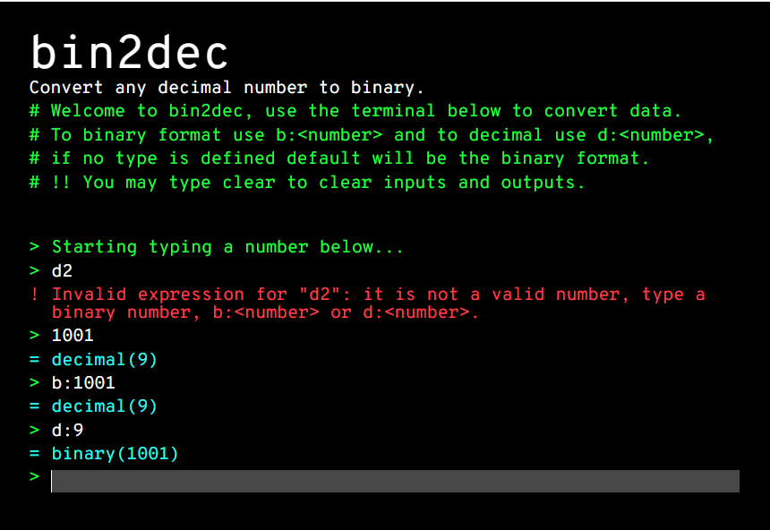

# Bin2Dec Challenge

  [](LICENSE)



> The current repository is part of a personal project. The main goal is to solve all app ideas from [florinpop17/app-ideas](https://github.com/florinpop17/app-ideas) repo. If you like this repo and want to support this journey, be free to donate any value to BTC wallet `3DNssbspq7dURaVQH6yBoYwW3PhsNs8dnK` ❤.

This repo contains a challenge proposed by [florinpop17/app-ideas](https://github.com/florinpop17/app-ideas). Bin2Dec allows the user to enter strings of up to 8 binary digits, 0's and 1's, in any sequence and then displays its decimal equivalent. See all challenge details [here](https://github.com/florinpop17/app-ideas/blob/master/Projects/1-Beginner/Bin2Dec-App.md).

Typescript and pure javascript DOM manipulation are the main programming languages of this repo. It "emulates" a terminal style and the user can send binary or decimal numbers. It also implements a "clear" word which clears the terminal.

**Why pure JS?** It is fast, and it is simple. The DOM manipulation required by user stories does not need complex DOM frameworks such as React, VUE.JS, etc.

## How to play with it?

1. Download or clone this repository by typing `git clone https://github.com/caiquearaujo/challenge-bin2dec-ts` on your machine;
2. Navigate to the root folder, and type on terminal `npm run js:serve`;
3. JS/CSS will be built on the `/dev` folder, and the server will run at `localhost:3000`.

## Changelog

See the [CHANGELOG](CHANGELOG.md) file for information about all code changes.

## Testing the code

This library uses the **Jest**. We carry out tests of all the main features of this application.

```bash
npm run test
```

## Contributions

See the [CONTRIBUTING](CONTRIBUTING.md) file for information before submitting your contribution.

## Credits

- [Caique Araujo](https://github.com/caiquearaujo)
- [All contributors](../../contributors)

## License

MIT License (MIT). See [LICENSE](LICENSE).